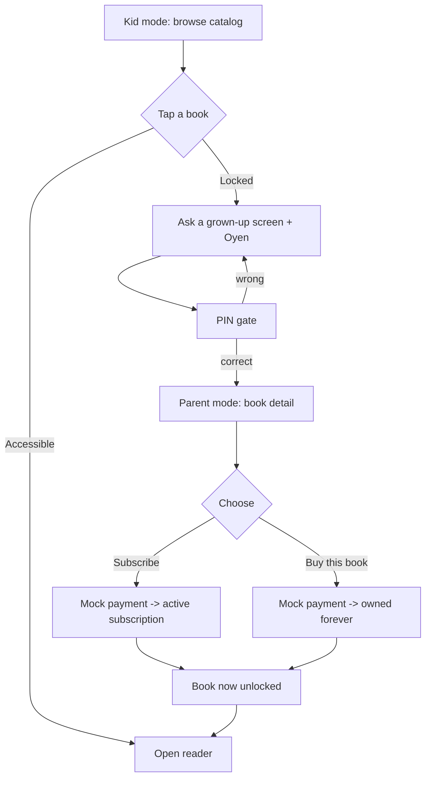

# PRODUCT.md — Product Definition

> Expands the **Product baseline** in `BASELINE.md`. Anchored: two monetization models (subscription = unlimited; one-time = own forever, **buy-to-keep**, **renew** on re-subscribe); three surfaces (**Kid** default / **Parent** behind a **PIN** / **Admin** separate role); English-only; tablet-first (Tablet > Mobile > Desktop); mascot **Oyen**. This is a **demo**; the PPT presents the **REAL** vision (see `BASELINE.md` §6 for DEMO↔REAL and note shortcuts in slides).

---

## 1. Overview

A paid digital storybook library for toddlers and kids. Parents discover and pay for safe, age-appropriate stories; children read them in a simple, delightful, tablet-friendly interface. Two ways to pay: **subscribe** for the whole library, or **buy** individual books to own forever.

**The core product bet:** the *child's* delight drives engagement, but the *parent's* trust drives payment and retention. So the product is two experiences in one brand — a joyful kid surface and a controlled parent surface — separated by a parent gate.

## 2. Target users & personas

### Primary — Parent / guardian (the **buyer**)
> *Dina, 34, mom of a 4-year-old. Browses on a tablet after bedtime prep.*
- **Goals:** find safe, age-appropriate, educational stories; control spending; set things up fast; trust that her kid can't rack up charges.
- **Pains:** kids tapping "buy" by accident; low-quality or inappropriate content; subscription fatigue; clunky kid apps.
- **Why target:** holds the wallet and makes every purchase/subscription decision. The entire monetization model depends on her trust and convenience.

### Reader — Child (the **consumer**, not the buyer)
> *Adit, 4. Can't read fluently yet; loves pictures and tapping.*
- **Goals:** look at colorful pictures, move through a story, feel rewarded, do it without help.
- **Pains:** can't read complex text, frustrated by small/fiddly UI, short attention span.
- **Why target:** the engagement engine. If Adit loves Oyen and the books, Dina subscribes and stays.

### Operator — Content admin
> *Internal catalog manager.*
- **Goals:** add books, keep metadata correct, control availability (draft / published / archived).
- **Why target:** catalog quality and correctness underpin discovery, pricing, and trust.

## 3. Key product decisions & assumptions

- **Buyer ≠ reader.** The account belongs to the parent; the child is a constrained view of it. CRUD belongs to a separate admin role.
- **Two independent entitlements:** ownership (permanent) and active subscription (catalog access). Tracked separately; never merged.
- **Buy-to-keep:** a subscriber can still buy a book to own it after cancelling; UI then says "You own this."
- **Renew on re-subscribe** (+30 days), no error.
- **Parent gate = PIN** before parent mode and any checkout. This is the product's #1 trust mechanism with parents — not a secondary UX nicety. The App Store and Play Store have both faced regulatory and class-action pressure over unauthorized in-app purchases by children. Apple's iOS Screen Time and Google Family Link are platform-level controls; our PIN is an *app-level* layer that complements them. Crucially: purchase UI is **structurally absent from kid mode** (not hidden, not permission-checked — simply not rendered at the DOM level). A toddler cannot accidentally buy because there is no buy button in their world.
- **English-only** for MVP; **tablet-first** responsive.
- **Placeholder content:** metadata is real and complete; book art/pages are labeled placeholders (real art generated later via `illustration-style.yaml`).
- **Mocked auth & payments** — enough to prove access control and flows without real providers.
- **Assumption:** age range per book guides discovery but does not hard-block reading (a parent may pick any book).

## 4. Child development foundation

> These are the domain-specific insights that drove core product decisions. They separate a kids' product from a generic app with a bright color scheme.

### Literacy stages — why kid mode is icon-led
| Age | Stage | Design implication |
|---|---|---|
| 2–3 | Pre-reader | Icons + audio only; zero text navigation |
| 4–5 | Emergent reader | Recognizes some words; still primarily icon-led |
| 6–8 | Early reader | Can follow text; benefits from word highlighting |

Kid mode uses icon + label navigation, never text-only menus. The REAL version adds audio narration + synchronized word highlighting — the icon-led architecture anticipates this without requiring a rebuild.

### Attention spans — why books are 6 pages
| Age | Sustained attention | Implication |
|---|---|---|
| 2–4 (toddler) | 2–5 minutes | One short book = one complete session |
| 4–5 (preschool) | 5–15 minutes | 1–2 books per session |
| 6–8 (early school) | 15–30 minutes | Multiple books; longer stories |

6-page books are calibrated for a single toddler session. The finish-book reward (Oyen celebration) provides a clear emotional endpoint — the child knows the session is complete, reducing "just one more" escalation that leads to overstimulation.

### Overstimulation — why animation is restrained
Toddlers have immature sensory processing. Rapid visual motion — fast cuts, looping animations, multiple simultaneous moving elements — causes overstimulation, not engagement. This is the same science behind why **Bluey, Peppa Pig, and Dora the Explorer** use deliberately slow pacing and frequent still frames. The pause is the content: holding on a character's face while they process information teaches comprehension, not boredom. In our UI: the reading view is a motion-free zone; animations are user-initiated and finite; we never have more than 2 animated elements on screen simultaneously in kid mode.

### Repetition — why catalog quality > catalog size
Children, especially toddlers, re-read the same book dozens of times. This is neurologically normal and beneficial — repetition builds vocabulary, story comprehension, and emotional safety ("I know what happens next"). A library of 8 excellent books is a better MVP than 50 mediocre ones. Curation philosophy: fewer, better.

### The accidental purchase problem
Toddlers cannot distinguish between "tapping for fun" and "tapping to buy." To them, every tap is the same gesture. This is not a UX problem — it's a cognitive development fact. Our architectural response: three surfaces (kid/parent/admin) where the purchase surface is **structurally inaccessible** from kid mode. Combined with a PIN gate, this provides defense in depth. No single failure mode (missed permission check, UI bug) results in an unauthorized purchase.

> **Comparison:** Apple requires a parental approval prompt for any in-app purchase over $0 in apps for ages 4+. We go further — there is no purchase prompt in kid mode at all.

### Tap target sizing — why kid mode uses oversized UI
Children's motor precision develops through childhood. Toddler precision is roughly equivalent to an adult using non-dominant hand while wearing oven mitts. Standard WCAG minimum (44px) targets adult users. For toddlers, 64–72px is the effective minimum. Failed taps cause frustration, which causes device-throwing. Oversize targets in kid mode are not over-engineering; they are the correct engineering.

### Physical-to-digital affordances — why swipe is the right gesture
The swipe-to-turn-page gesture directly maps to how toddlers interact with physical board books. This is a deliberate affordance: the digital reading experience should feel like a continuation of the physical one, not a departure from it. Horizontal swipe for page turns, no complex gestures (no double-tap, no long-press) in kid mode.

### No FOMO, no urgency mechanics — by design
Toddlers don't need FOMO to engage — they're naturally curious and love discovery. Showing "you're missing 47 locked books" causes distress, not motivation. Design rules for kid mode: no countdown timers, no "limited time" labels, no social comparison, no lock states shown in an anxiety-inducing way. Oyen softens every locked moment ("Ask a grown-up 🐾") rather than using a hard block.

### Screen time positioning — the parent's frame
Parents are highly sensitive about screen time. The product is positioned as **"active screen time"** (interactive, narrative, educational) not passive entertainment. The pediatric community distinguishes between: (1) passive video, (2) interactive/educational digital content, and (3) co-viewing with discussion. Our reading format — especially with REAL narration + word highlighting — falls squarely into category 2, and approaches category 3 if a parent reads along. This framing is the sales argument to skeptical parents.

## 5. Monetization model
|---|---|---|---|
| **Subscription** (monthly, single tier) | Unlimited access to the **live** catalog, incl. books added later | While active; **renews** on re-subscribe | Lapses → access falls back to owned books only |
| **One-time purchase** | Permanent ownership of that specific book | Forever, survives subscription churn | **Buy-to-keep** allowed even while subscribed |
| **Free books** | Open to any logged-in user | Always | Used as taste-of-product / acquisition |

> **DEMO:** payments are mocked (always succeed, with a forced-fail path to demo errors). **REAL:** Stripe/Midtrans + webhooks + idempotency.

## 5. Feature list (MVP)

**Auth & profiles**
- Mocked login: standard email/password form **plus** quick-pick profile chips (tap → instant login).
- Two seeded accounts: `parent@demo` (USER) and `admin@demo` (ADMIN). Demo PIN shown on screen for reviewers.

**Kid mode (default)**
- Browse catalog grid; filter by category and age.
- Book detail with clear accessible/locked state.
- Read accessible books in the paper-flip reader; reward (confetti + Oyen) on finishing.
- Locked books show a lock + "Ask a grown-up".

**Parent mode (behind PIN)**
- Set / enter PIN.
- Subscribe (mock); view subscription status; renew.
- Buy a book (mock, buy-to-keep).
- Library: owned books + subscription status; purchase history.

**Admin (separate account)**
- Book CRUD: create, edit, archive (soft-delete).
- Manage categories; set status (draft / published / archived), price, age range.
- Manage story content: set the book image and enter text page-by-page with a simple next/previous flow.

**Cross-cutting**
- Access enforcement: browse = soft (lock badges), content = hard (blocked).
- Validation + friendly error states (Oyen on empty/error/404).

## 6. The three surfaces (behavior)

| Surface | Entry | Can do | Cannot do |
|---|---|---|---|
| **Kid** | Default after login | Browse, read accessible books, see locked items | Buy, subscribe, manage, CRUD |
| **Parent** | PIN gate from kid mode (or Parent chip → PIN) | Subscribe, buy, library, account | CRUD (that's admin) |
| **Admin** | Log in as `admin@demo` | Book/category CRUD, story content editing | (Not the kid/parent shopping flows) |

**Profile chips (demo convenience):** *Kid* → parent account, lands in kid mode · *Parent* → parent account, then PIN → parent mode · *Admin* → admin account → admin panel.

## 7. Core user flows

### 7.1 The unlock journey (the key flow)

### 7.2 First launch + onboarding (4-step, shown once per account)

Login screen (Oyen waving) → email/password **or** tap a profile chip → after first login, the 4-screen onboarding runs before the app:

| # | Screen | Content | Functional purpose |
|---|---|---|---|
| 1 | **Welcome** | Oyen waving · tagline *"A cozy little library, just for them 🐾"* · "Let's start" | First impression / brand |
| 2 | **How it works** | Two cards: [🐾 Kid Mode — browse & read freely] [🔒 Parent Mode — subscribe, buy, manage · protected by your PIN] | Sets expectations for both modes upfront; reduces "why can't my kid buy?" confusion |
| 3 | **Set Parent PIN** | `InputOTP` 4 digits → confirm → save | Mandatory functional setup; PIN required to enter parent mode anywhere |
| 4 | **Who's reading today?** | Child's name (text input, **optional**) + age range (optional) · "Skip" available | Personalizes the app from minute 1; pre-filters book catalog by age |

After screen 4 → land in **kid mode**. If name was entered, kid mode header shows *"Ready to read, [name]? 🐱"*.

> **DEMO:** PIN shown on login screen for reviewers: `1234`. **REAL:** PIN hashed server-side; biometric fallback (Face ID / fingerprint).

### 7.3 Subscribe
Parent mode → "Unlock everything" → Subscribe → mock payment → subscription `ACTIVE` (+30d) → entire catalog unlocked → toast + return.

### 7.4 Buy-to-keep
Any book → (kid: "ask a grown-up" → PIN) → parent mode book detail → "Buy this book" → mock payment → owned forever → badge flips to **OWNED** (even if also subscribed).

### 7.5 Reading
Open accessible book → reader → **swipe / paper-flip** through pages (single page on narrow, two-page spread on wide) → last page → **reward** (confetti + Oyen celebrate) → back to library.

### 7.6 Admin
Log in as `admin@demo` → book table → Create/Edit (title, author, description, cover slot, price, age range, categories, status) → Pages → set book image + enter page text with Prev/Next → Archive (soft-delete, confirm dialog). Archived books stay readable for owners, hidden from others.

## 8. Access control — product view

Users *see* the same rule the backend enforces: **accessible if** admin, free, owned, or actively subscribed — otherwise **locked**.

| What the user does | What they see |
|---|---|
| Kid taps a free book | Opens immediately |
| Kid taps a locked book | Lock + "Ask a grown-up" + Oyen → PIN gate |
| Kid looks for a buy button | **There is none.** Purchase UI does not exist in kid mode. |
| Subscriber opens any book | Opens (badge: "Included in subscription") |
| Owner opens their book | Opens (badge: "You own this") — shows OWNED even if also subscribed |
| Subscription expired, book not owned | Locked again — no interruption to any session in progress |
| Subscription expires mid-session | Current read session completes; lock applies on next open |
| Owned book later archived by admin | Still readable for owner; invisible to everyone else |
| Already own / already subscribed | No double-charge; "you already have this" shown clearly |
| Payment fails (demo forced) | Friendly error + Oyen, nothing unlocked, payment ledger records FAILED |
| PIN entered wrong | Gentle Oyen shake; **no lockout in demo. REAL:** lockout after 3 attempts |
| Age-range mismatch (parent picks older book for toddler) | Not blocked — age filter is discovery guidance, not enforcement; parent's choice |
| Admin archives a book a user is currently reading | Session completes; next open → still readable if owned, else hidden |
| Multiple devices (family tablet + parent phone) | JWT is stateless; any device with valid token gets correct access |

(Full technical matrix + HTTP status codes live in TECH.md.)

## 9. Success metrics & how to measure

| Metric | Definition | Measure via |
|---|---|---|
| **Activation** | % of new accounts that open ≥1 book in week 1 | read-content events / new users |
| **Free→paid conversion** | % who subscribe or make a first purchase | first successful payment / user |
| **Monetization mix** | Subscription vs one-time revenue share | revenue grouped by payment type |
| **Subscription retention / churn** | Renewals vs lapses | subscription renew vs expire |
| **ARPU / LTV** | Revenue per user; lifetime value | revenue ÷ active users; cohort projection |
| **Engagement** | Books read per child per week | read-content events over time |
| **Trust signal** | Accidental-purchase / refund requests | (post-MVP) support + refund events |

> **DEMO:** these are instrumented *as a plan* — purchase, subscribe, and read-content are the natural event points. **REAL:** wired to an analytics pipeline (e.g., product analytics + warehouse).

## 10. Trade-offs (product)

**In for MVP:** two monetization models, three surfaces, PIN gate, category/age filtering, library, admin CRUD, the paper-flip reader, reward moment, 4-step onboarding, domain-aligned motion restraint.

**Deliberately out — and why each is the right cut:**
| Cut | Why it's right for MVP |
|---|---|
| Audio narration | High production cost; placeholder-first lets us prove the access/commerce model before committing to content |
| Multi-child profiles | Complex UX (child-switching, per-child progress); single-child assumption is valid for a first cohort of parents |
| Subscription tiers | One tier reduces cognitive load at purchase moment; complexity adds after we know conversion rates |
| Refunds | Requires payment gateway; mock doesn't support it; policies designed in advance (in roadmap) |
| COPPA / GDPR-K compliance | Requires legal counsel, data flows audit, consent management; not shortcuts — deferred properly |
| Offline downloads | High complexity (service worker, encrypted local storage); toddlers read at home, not planes |
| Search | Filter by category + age covers discovery at 8-book scale; search earns its complexity at 50+ books |
| Real-time "currently reading" sync | Nice for family UX; stateless JWT + TanStack Query handles basic multi-device already |

## 11. High-level roadmap

- **Now (MVP):** three surfaces, PIN gate, two monetization models, buy-to-keep, paper-flip reader, reward, onboarding, admin CRUD, deployed.
- **Next:** real illustrated art + audio narration with word highlighting (pre-reader literacy support); multi-child profiles with per-child read history; search; ID/EN localization; analytics dashboard (activation, conversion, engagement); subscription tiers.
- **Later:** real payment gateway (Stripe/Midtrans) + webhooks + grace periods + refunds; COPPA/GDPR-K compliance + parental consent; iOS Screen Time / Google Family Link deep integration; offline downloads; gifting; teacher/classroom mode; free-trial acquisition mechanic.

## 12. Resolved
- **Onboarding:** 4-step multi-screen (Welcome → How it works → Set PIN → Who's reading?). PIN setup is mandatory on first run.
- **Demo PIN:** `1234`, displayed on the login screen for reviewers.
